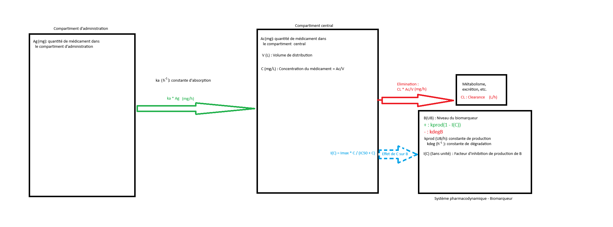
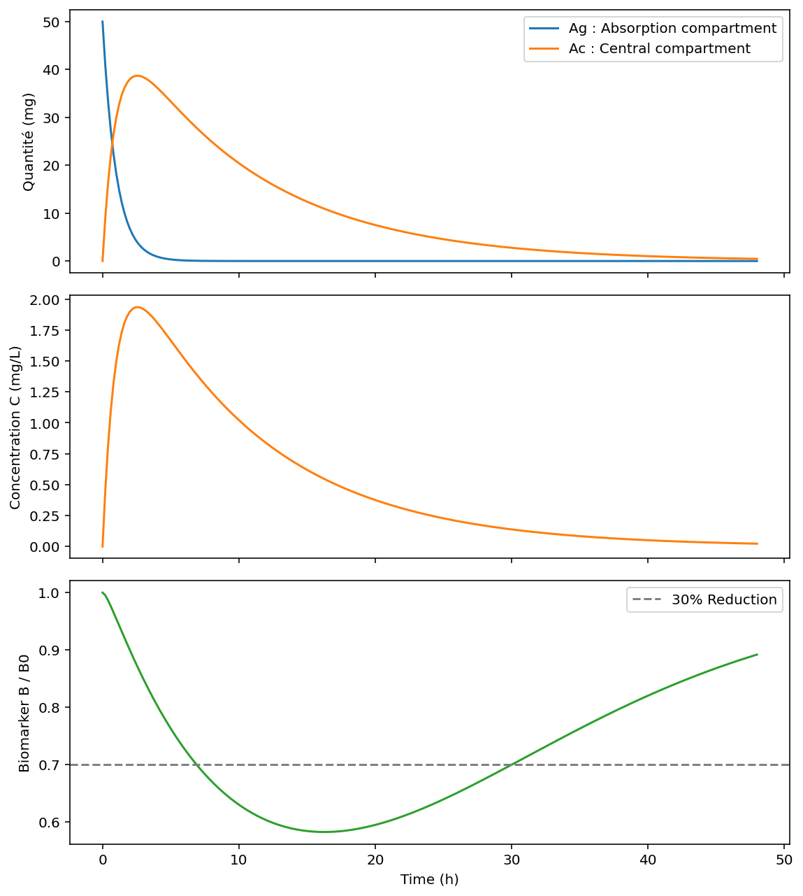
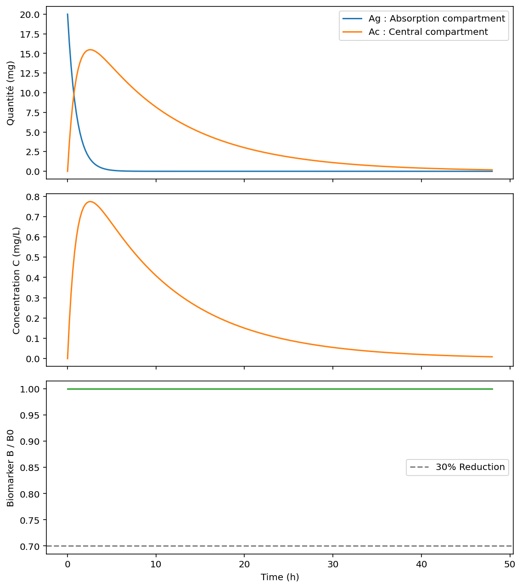
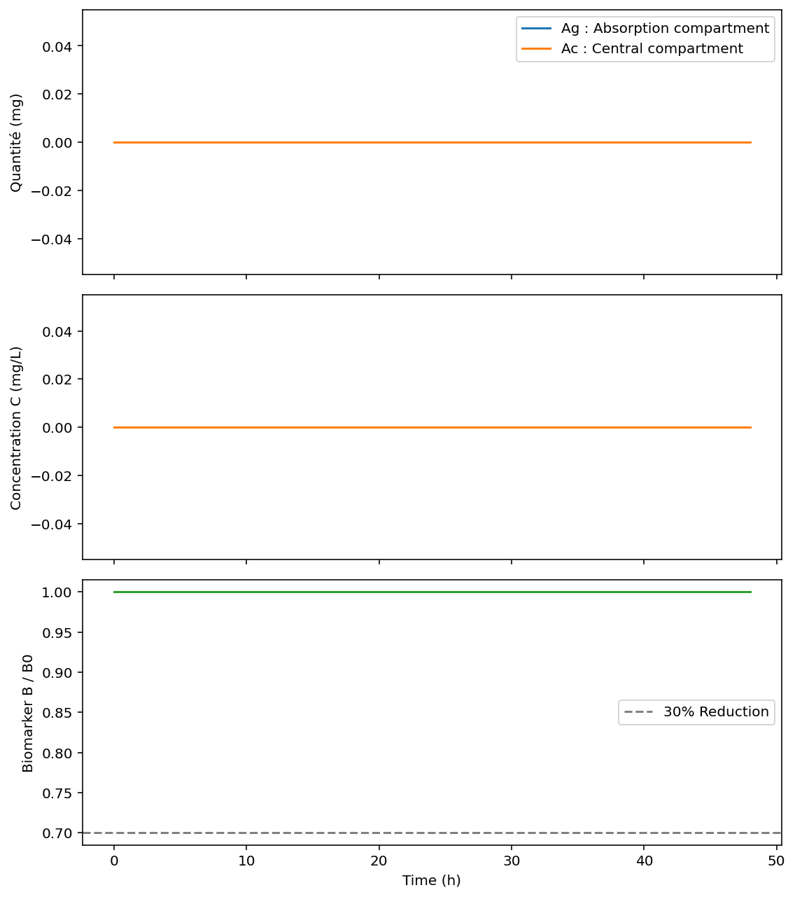
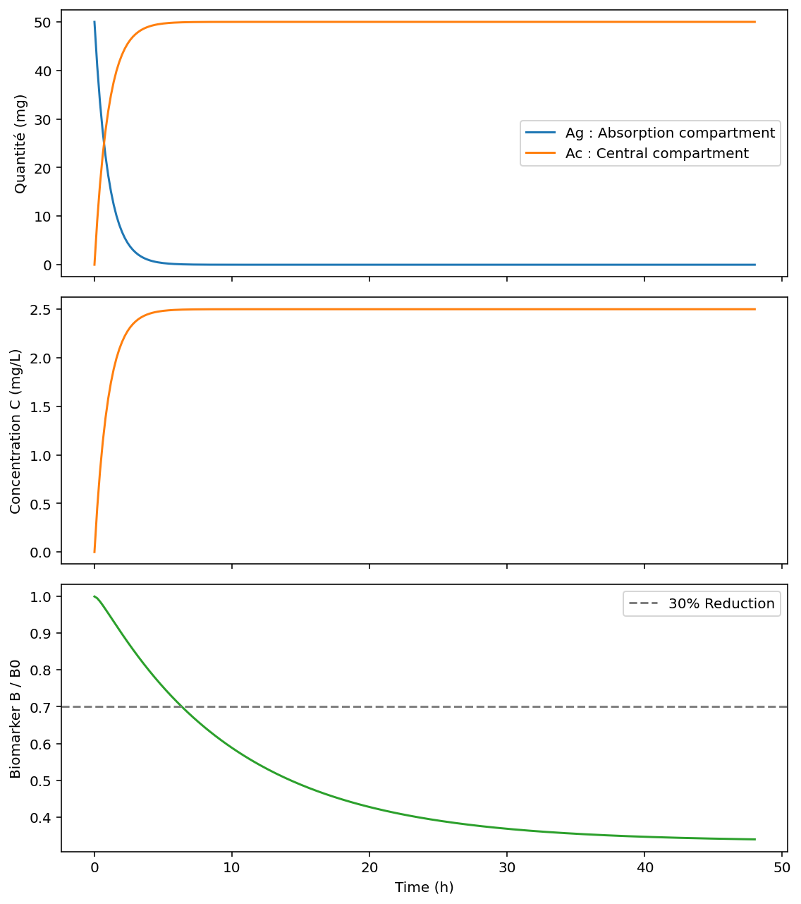
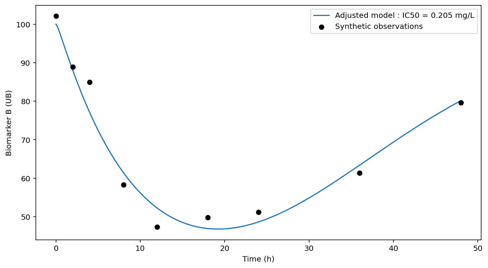
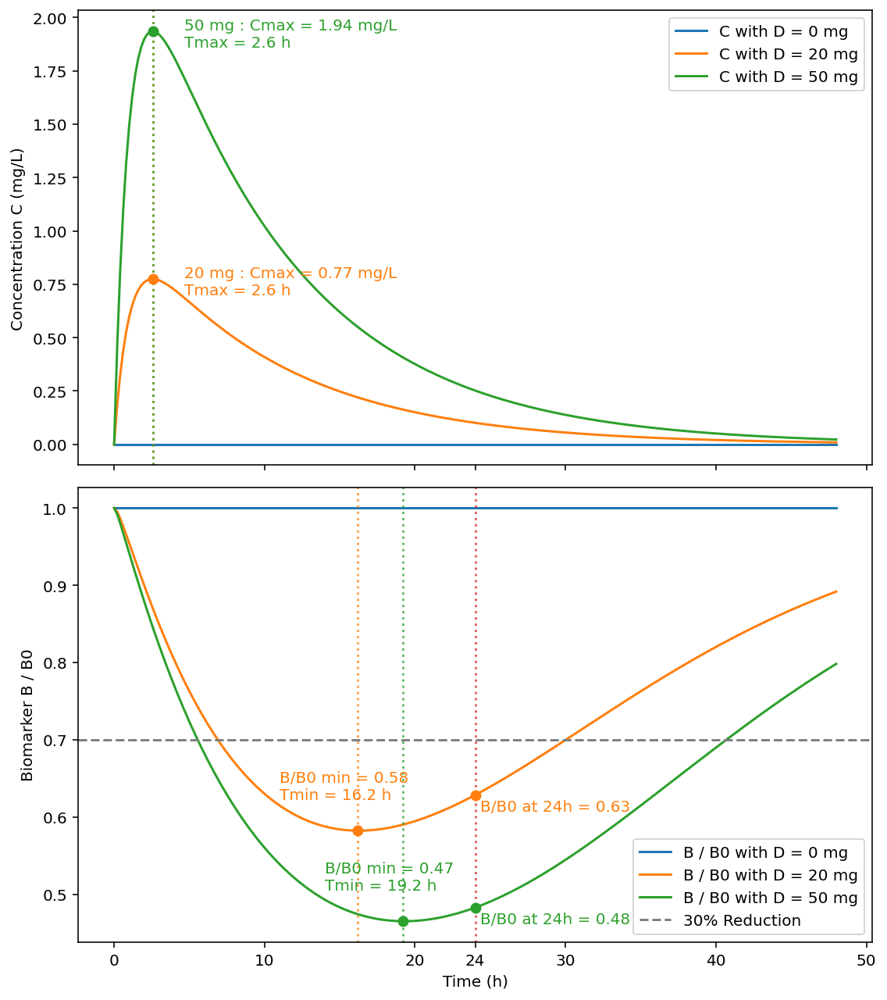
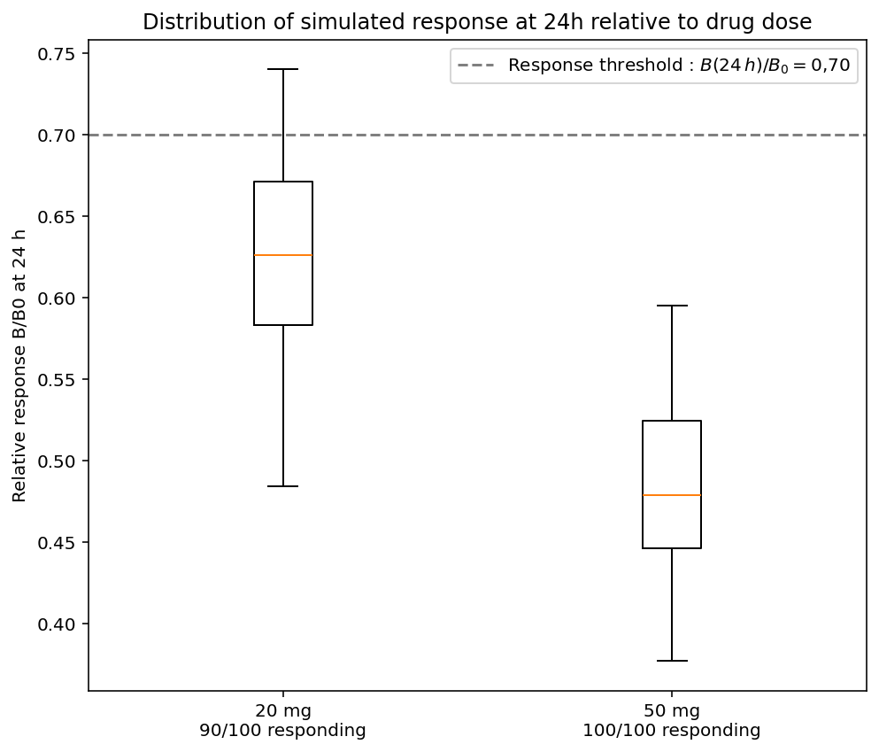

# PK/PD Simulation of Individual Responses to Drug Dose

This project is a simplified PK/PD modeling exercise. It simulates drug absorption, drug concentration in a central compartment, and the response of a biomarker.

The model is used to explore how drug dose, clearance (`CL`), and pharmacodynamic sensitivity (`IC50`) influence biomarker response. It also compares the responses of a virtual population treated with 20 mg or 50 mg.

This project is intended as an educational modeling exercise. It is not a clinically validated dose-selection tool.

## Research question

How does interindividual variability in clearance and drug sensitivity affect the proportion of individuals reaching a response threshold 24 hours after treatment?

An individual is considered a responder when:

$$
\frac{B(24\ \mathrm{h})}{B_0} \leq 0.70
$$

where $B_0$ is the baseline biomarker value and $B(24\ \mathrm{h})$ is the simulated biomarker value 24 hours after treatment.

## Mathematical model

The model has three state variables:

- $A_g(t)$: amount of drug at the administration site.
- $A_c(t)$: amount of drug in the central compartment.
- $B(t)$: biomarker level.

The drug concentration in the central compartment is:

$$
C(t) = \frac{A_c(t)}{V}
$$

Drug concentration inhibits biomarker production through an $I_{\max}$ model:

$$
I(C) = \frac{I_{\max} \times C}{IC_{50} + C}
$$

The system of ordinary differential equations is:

$$
\frac{dA_g}{dt} = -k_a A_g
$$

$$
\frac{dA_c}{dt} = k_a A_g - CL \times C
$$

$$
\frac{dB}{dt} = k_{\mathrm{prod}} \times \left(1 - I(C)\right) - k_{\mathrm{deg}} \times B
$$

The normalized biomarker response used to compare doses is:

$$
R(t) = \frac{B(t)}{B_0}
$$

## Baseline parameters

The following parameter set is used as the baseline model:

```python
params = {
    "ka": 1.0,      # Drug absorption rate constant
    "CL": 2.0,      # Drug clearance
    "V": 20.0,      # Central compartment volume of distribution
    "Imax": 0.8,    # Maximum inhibition of biomarker production
    "IC50": 0.2,    # Drug concentration producing half-maximal inhibition
    "kprod": 10.0,  # Biomarker production rate
    "kdeg": 0.1,    # Biomarker degradation rate constant
    "dose": 50.0,   # Administered drug dose
}
```

| Parameter | Description | Baseline value |
| --- | --- | ---: |
| `ka` | Drug absorption rate constant | 1.0 |
| `CL` | Drug clearance | 2.0 |
| `V` | Central compartment volume of distribution | 20.0 |
| `Imax` | Maximum inhibition of biomarker production | 0.8 |
| `IC50` | Concentration producing half-maximal inhibition | 0.2 |
| `kprod` | Biomarker production rate | 10.0 |
| `kdeg` | Biomarker degradation rate constant | 0.1 |
| `dose` | Administered drug dose | 50.0 mg |

The baseline biomarker level in the absence of drug inhibition is:

$$
B_0 = \frac{k_{\mathrm{prod}}}{k_{\mathrm{deg}}}
$$

With the baseline values used here:

$$
B_0 = \frac{10.0}{0.1} = 100
$$

## Administration scheme



## Baseline simulation

The figure below shows the behavior of the model using the baseline parameters.



## Model behavior checks

The following simulations test specific limiting cases and help verify that the implementation behaves consistently with the model equations.

| Case | Expected behavior | Simulation |
| --- | --- | --- |
| No maximal drug effect (`Imax = 0`) | Drug concentration does not inhibit biomarker production |  |
| No drug administration (`dose = 0`) | No drug enters the system and the biomarker remains at its baseline level |  |
| No clearance (`CL = 0`) | Drug is not eliminated from the central compartment |  |

## Parameter calibration

Synthetic biomarker observations were generated at several sampling times. The model was calibrated by adjusting `IC50` while keeping the other parameters fixed.

For each candidate value of `IC50`, the model predicts a biomarker value at every sampling time. The sum of squared differences between predictions and observations is:

$$
S(IC_{50}) = \sum_{i=1}^{n}
\left[\hat{B}(t_i; IC_{50}) - B_{\mathrm{obs}}(t_i)\right]^2
$$

Here, $t_{i}$ is a sampling time, $B_{obs}$ is a synthetic observation, and $\hat{B}$ is the biomarker value predicted by the model. The estimated $IC_{50}$ is the value that minimizes $S(IC_{50})$.

The fitted value was:

$$
\widehat{IC}_{50} = 0.205\ \mathrm{mg/L}
$$

The fitted curve captures the overall decrease and subsequent recovery of the biomarker in the synthetic observations.



Because the observations are synthetic, this calibration demonstrates parameter estimation but does not validate the model against clinical data.

## Dose comparison

The model was simulated with two doses: 20 mg and 50 mg.



## Virtual population

A virtual population was generated by assigning each individual different values of `IC50` and `CL`.

Each individual was simulated under both dose scenarios. The same individual parameters were kept for the 20 mg and 50 mg simulations, allowing the effect of dose to be compared for the same virtual individuals.

The value of $B(24\ \mathrm{h})/B_0$ was extracted for every individual. Individuals with:

$$
\frac{B(24\ \mathrm{h})}{B_0} \leq 0.70
$$

were counted as responders.

## Individual responses at 24 hours

The boxplots compare the distributions of $B(24\ \mathrm{h})/B_0$ at 20 mg and 50 mg.

The dashed line represents the response threshold. The line inside each box is the median. The box extends from the first quartile to the third quartile.



| Dose | Responders at 24 h | Proportion of responders |
| --- | ---: | ---: |
| 20 mg | 90 / 100 | 90% |
| 50 mg | 100 / 100 | 100% |

Under the assumptions of this simulation, 50 mg allows all 100 virtual individuals to meet the response threshold, while 20 mg allows 90 of 100 individuals to meet it.

## Limitations

- The model is simplified and uses illustrative parameter values.
- The response threshold of $B(24\ \mathrm{h})/B_0 \leq 0.70$ is an assumption of this exercise.
- The virtual population depends on the selected distributions for `CL` and `IC50`.
- The model was calibrated on synthetic observations, not experimental or clinical data.
- Only one parameter, $IC_{50}$, was estimated during the calibration.
- The analysis focuses on response after 24 hours and does not evaluate safety, toxicity, or long-term outcomes.
- Comparing only 20 mg and 50 mg does not identify the minimum dose able to reach a chosen responder-rate target.

## Possible next steps

- Estimate several parameters jointly using data with defined measurement error.
- Test intermediate doses and plot the proportion of responders as a function of dose.
- Perform sensitivity analyses on `CL`, `IC50`, `Imax`, `ka`, `kprod`, and `kdeg`.
- Include uncertainty in model parameters and quantify uncertainty in simulated response rates.
- Compare model predictions with independent experimental or clinical data.

## Figures

The README expects the following files in the `figures/` directory:

```text
figures/
├── Schema_administration.png
├── Base_parameters.png
├── Imax=0.png
├── Dose=0.png
├── CL=0.png
├── Parameter_calibration.png
├── Dose_comparision.png
└── Box_individuals.png
```